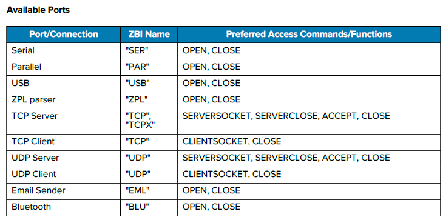

# Zebra-Printer_Link-OS_Send Event Notice to Host by ZBI
# ZBIを用いてプリンタのイベントを通知する方法


ZBIはBasic型のプリンタ開発言語。ZPLやプリンタ機能をだけでは対応できない機能をプリンタに実装することができる。
Link-OS プリンタでは下記のようなイベントが特定のI/Fから通知可能。

- 本体ボタンの押下*
- 各種エラー
- カスタムエラー・メッセージ

\* ボタンイベントはプリンタによって、サポート可否があるためZBI 開発者ガイドを参照すること。

</br>
</br>

### 利用可能なI/F



</br>
</br>

### コード例： 任意のタイミングでエラー出力

USBポートへエラーメッセージを出力

```
AUTONUM 1,1
OPEN #1:NAME "ZPL"
PRINT #1: "^XA^SXO,A,Y,Y^XZ"
CLOSE #1
FOR I=1 TO 10
OPEN #2:NAME "USB"
PRINT #2: I
SLEEP 2
IF MOD(I,2)=1 THEN
SETERR
ELSE
CLRERR
ENDIF
CLOSE #2
NEXT I
```